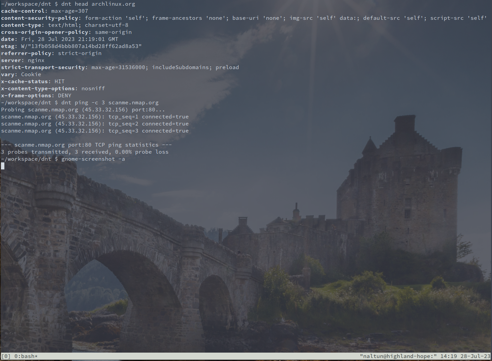

# dnt (D networking tools)

`dnt` is a collection of lightweight networking utilities. The collection currently includes:
* head
* host
* ping
* proxy



These tools will be helpful when administrating networks, developing web applications,
and conducting penetration tests.

To get started, run:
```sh
deno run main.ts -h
```

To install, run:
```sh
# additionally, add `-f' or `--force' if you get `error: Existing installation found.'
deno task install
```

# LICENSE

Mozilla Public License, version 2.0
