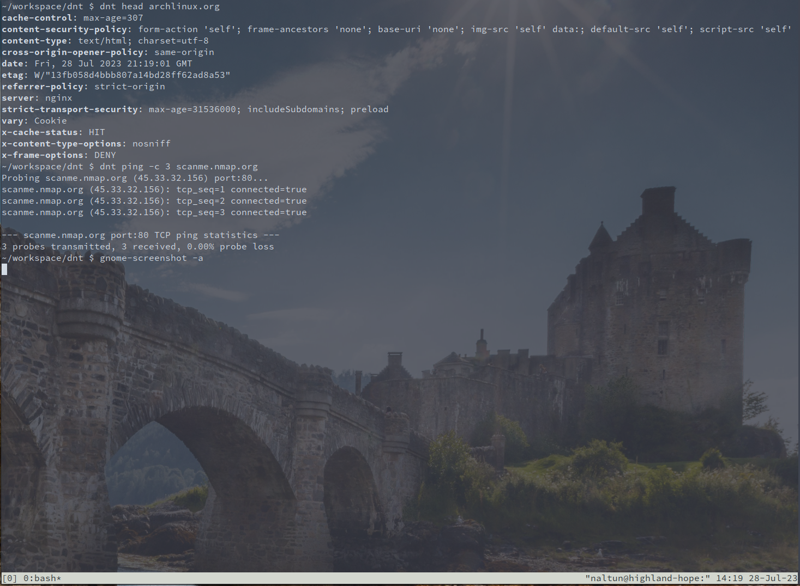

# dnt (D networking tools)

`dnt` is a collection of lightweight networking utilities. The collection currently includes:
* head
* ping



These tools might be useful for system administrators and developers troubleshooting network
infrastructure, and will be familiar to users of Unix and the Windows command prompt.

To get started, run:
```sh
deno run main.ts -h
```

To install, run:
```sh
# additionally, add `-f' or `--force' if you get `error: Existing installation found.'
deno task install
```

# LICENSE

Mozilla Public License, version 2.0
